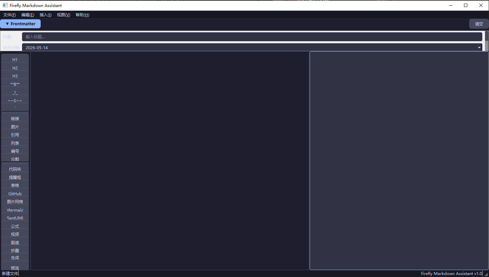

# 🔥 Firefly Markdown Assistant

> 一款专为 [Firefly Astro 博客主题](https://github.com/CuteLeaf/Firefly) 设计的 Markdown 文章可视化辅助生成工具。

[](https://www.python.org/)
[](https://pypi.org/project/PySide6/)
[](LICENSE)

---

## ✨ 功能特性

- 🧾 **Frontmatter 可视化编辑** — 14 个字段的表单式编辑，一键生成 / 更新 / 解析
- 💬 **提醒框（Admonitions）** — 支持 GitHub / Obsidian / VitePress / Docusaurus 四种风格，30+ 类型
- 🖥️ **Expressive Code 代码块** — 语法高亮、行标记、插入/删除行、文本标记、折叠、行号、自动换行等
- 📊 **Mermaid 图表** — 流程图、时序图、甘特图、类图、状态图、饼图（6 种内置模板）
- 🏗️ **PlantUML 图表** — 活动图、状态图、用例图、组件图、部署图、ER 图、时序图、C4 容器图（8 种模板）
- 📐 **KaTeX 数学公式** — 行内公式、块级公式、矩阵、化学方程式
- 🖼️ **图片画廊网格** — `[grid]` 语法，最多 4 张并排展示
- 🎬 **视频嵌入** — YouTube / Bilibili iframe 嵌入
- 🙈 **剧透文本** — `:spoiler[]` 语法
- 📦 **GitHub 仓库卡片** — `::github{}` 语法
- 📂 **可折叠详情** — `<details>` / `<summary>` 语法
- 👁️ **实时预览** — 500ms 防抖，编辑器内容变化自动刷新
- 💾 **自动保存** — 每 30 秒自动保存
- ⌨️ **快捷键支持** — Ctrl+S 保存、Ctrl+N 新建、Ctrl+P 预览切换等
- 🌙 **暗色主题** — Catppuccin Mocha 配色

## 📸 界面预览



## 🚀 快速开始

### 环境要求

- Python 3.12+
- Conda（推荐）

### 安装

```bash
# 1. 创建并激活 conda 虚拟环境
conda create -n firefly-md python=3.12 -y
conda activate firefly-md

# 2. 安装依赖
pip install PySide6>=6.5.0

# 3. 启动
python main.py
```

> 💡 推荐使用清华 PyPI 镜像加速：`pip install PySide6 -i https://pypi.tuna.tsinghua.edu.cn/simple`

## 📖 使用指南

### 工作流程

1. **填写 Frontmatter** — 在顶部面板中输入标题、日期、标签、分类等信息
2. **撰写正文** — 在中央编辑器中使用 Markdown 语法编写文章
3. **插入元素** — 通过左侧工具栏或菜单栏 `插入(I)` 添加提醒框、代码块、图表等
4. **实时预览** — 按 `Ctrl+P` 或点击底部「预览」按钮切换预览面板
5. **保存发布** — 按 `Ctrl+S` 保存为 `.md` 文件，放入 Firefly 博客的 `posts/` 目录

### 快捷键

| 快捷键 | 功能 |
|--------|------|
| `Ctrl+N` | 新建文件 |
| `Ctrl+O` | 打开文件 |
| `Ctrl+S` | 保存文件 |
| `Ctrl+P` | 切换预览面板 |
| `Ctrl+Z` | 撤销 |
| `Ctrl+Y` | 重做 |
| `Ctrl+Shift+F` | 生成 / 更新 Frontmatter |
| `Ctrl+Shift+A` | 插入提醒框 |
| `Ctrl+Shift+C` | 插入代码块 |
| `Ctrl+Shift+M` | 插入 Mermaid 图表 |
| `Ctrl+Shift+P` | 插入 PlantUML 图表 |
| `Ctrl+Shift+T` | 插入表格 |

## 📂 项目结构

```
.
├── app/                        # 应用配置
│   ├── __init__.py
│   └── constants.py            # 暗色主题样式表
├── core/                       # 核心逻辑
│   ├── __init__.py
│   └── markdown_utils.py       # 所有 Firefly 语法模板与生成器
├── ui/                         # 界面组件
│   ├── __init__.py
│   ├── main_window.py          # 主窗口、Frontmatter 面板、预览
│   └── dialogs/                # 各功能对话框
│       ├── admonition_dialog.py    # 提醒框
│       ├── code_block_dialog.py    # 代码块
│       ├── image_grid_dialog.py    # 图片网格
│       ├── mermaid_dialog.py       # Mermaid 图表
│       ├── plantuml_dialog.py      # PlantUML 图表
│       └── table_dialog.py         # 表格
├── main.py                     # 启动入口
├── requirements.txt            # 依赖声明
└── .gitignore
```

## 🛠️ 技术栈

| 技术 | 用途 |
|------|------|
| **Python 3.12** | 编程语言 |
| **PySide6** | Qt 6 的 Python 绑定，提供原生 GUI |
| **Catppuccin Mocha** | 暗色主题配色方案 |

## 🤖 Vibe Coding

本项目由 **Vibe Coding** 方式完成——通过自然语言描述需求，由 AI 辅助完成编码。

| 项目 | 信息 |
|------|------|
| **AI 工具** | [DeepSeek TUI](https://deepseek.com/) — 终端原生 AI 编程助手 |
| **模型** | DeepSeek V4（1M-token 上下文窗口） |
| **Vibe Coding 会话数** | 2 轮 |
| **总代码量** | ~1800 行（16 个文件） |
| **开发用时** | < 2 小时 |

> 💬 "先阅读 `posts/` 目录下的所有 markdown 文件……为我做一个 Python GUI 程序用于辅助生成文章的 markdown 文件。GUI 界面简洁美观，操作逻辑流程。"

## 📄 License

MIT © 2026

---

⭐ 如果这个工具对你有帮助，欢迎给 [Firefly](https://github.com/CuteLeaf/Firefly) 也点个 Star！
